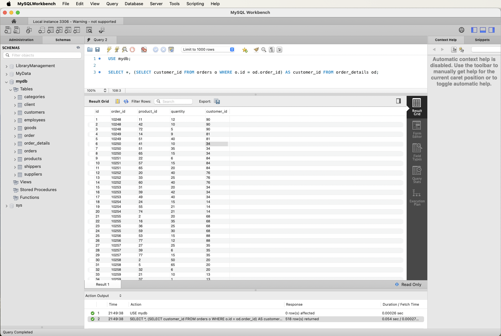
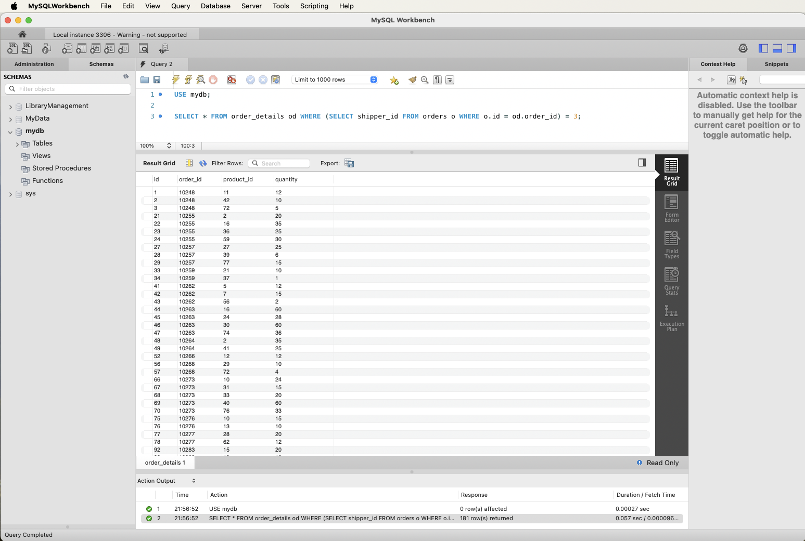
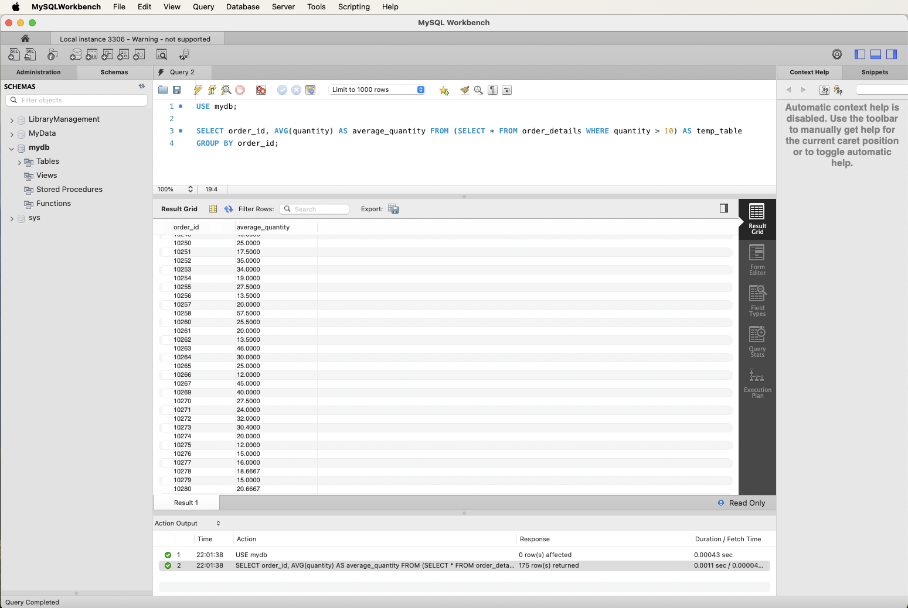
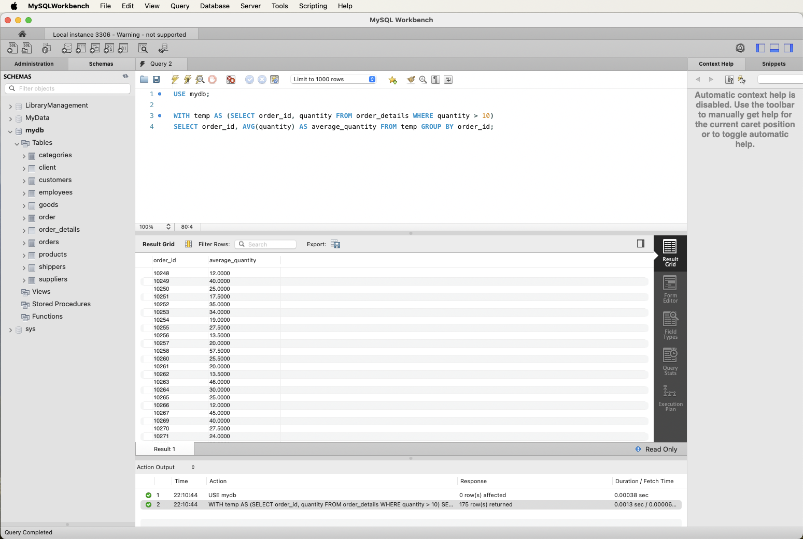

# Домашнє завдання до Теми 5. Вкладені запити. Повторне використання коду

- Ну що, налаштувалися на виконання нового завдання? Тодi полетiли! 🎢

- У рамках цього домашнього завдання ви отримаєте можливість застосувати вкладені SQL запити, що є важливою складовою вивчення реляційних баз даних. Використання вкладених запитів в SQL є потужним інструментом для вибірки та обробки даних з різних таблиць, дозволяючи розв’язувати складні завдання та оптимізувати роботу з базами даних.

- Починаємо?! 🧙🏼‍♂️

### Підготовка та завантаження домашнього завдання

1. Створіть публічний репозиторій `goit-rdb-hw-05`
2. Виконайте завдання та відправте у свій репозиторій скриншоти запитів і результатів, а також текст SQL коду в текстовому файлі.
3. Завантажте скриншоти і текстовий файл на свій комп’ютер та прикріпіть їх в LMS архівом. Назва архіву повинна бути у форматі ДЗ5_ПІБ.
4. Прикріпіть посилання на репозиторій `goit-rdb-hw-05` та відправте на перевірку.

### Формат здачі

- Прикріплені файли репозиторію архівом із назвою ДЗ5_ПІБ.
- Посилання на репозиторій.

## ВАЖЛИВО

- Будь ласка, пронумеровуйте скріншоти, щоб менторам було зрозуміло, до якого етапу ДЗ відноситься кожний з них. Наприклад, якщо файл відноситься до пункту 3, то назва файла має починатися так: p3\_.

### Формат оцінювання

Оцінка від 0 до 100:

- Кожне завдання оцінюється в 20 балів.
- Якщо є помилки або недоліки виконання, кількість балів на кожному етапі зменшується пропорційно наявних помилок на розсуд ментора.

## Опис домашнього завдання

1. Напишіть SQL запит, який буде відображати таблицю order_details та поле customer_id з таблиці orders відповідно для кожного поля запису з таблиці order_details.

Це має бути зроблено за допомогою вкладеного запиту в операторі SELECT.

2. Напишіть SQL запит, який буде відображати таблицю order_details. Відфільтруйте результати так, щоб відповідний запис із таблиці orders виконував умову shipper_id=3.

Це має бути зроблено за допомогою вкладеного запиту в операторі WHERE.

3. Напишіть SQL запит, вкладений в операторі FROM, який буде обирати рядки з умовою quantity>10 з таблиці order_details. Для отриманих даних знайдіть середнє значення поля quantity — групувати слід за order_id.

4. Розв’яжіть завдання 3, використовуючи оператор WITH для створення тимчасової таблиці temp. Якщо ваша версія MySQL більш рання, ніж 8.0, створіть цей запит за аналогією до того, як це зроблено в конспекті.

5. Створіть функцію з двома параметрами, яка буде ділити перший параметр на другий. Обидва параметри та значення, що повертається, повинні мати тип FLOAT.
   Використайте конструкцію DROP FUNCTION IF EXISTS. Застосуйте функцію до атрибута quantity таблиці order_details .

### Критерії прийняття

1. Прикріплені посилання на репозиторій `goit-rdb-hw-05` та безпосередньо самі файли репозиторію архівом.
2. Правильно написано всі 5 SQL запитів відповідно до заданих умов виконання. Запити виконуються й дають очікуваний результат.

### Результат виконаного ДЗ

